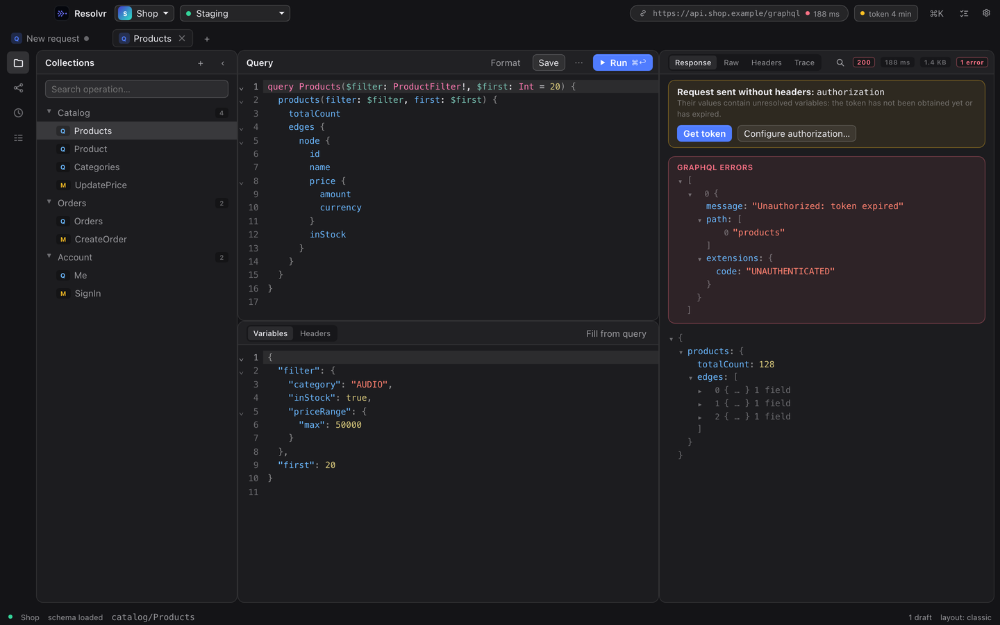
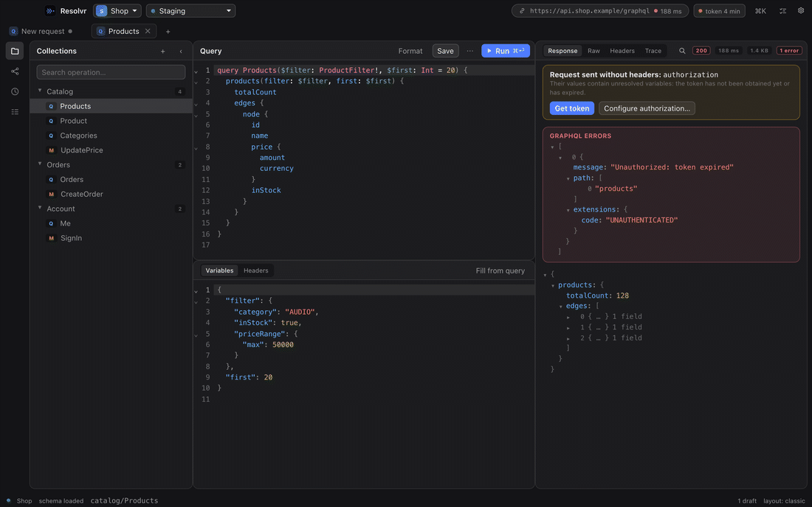
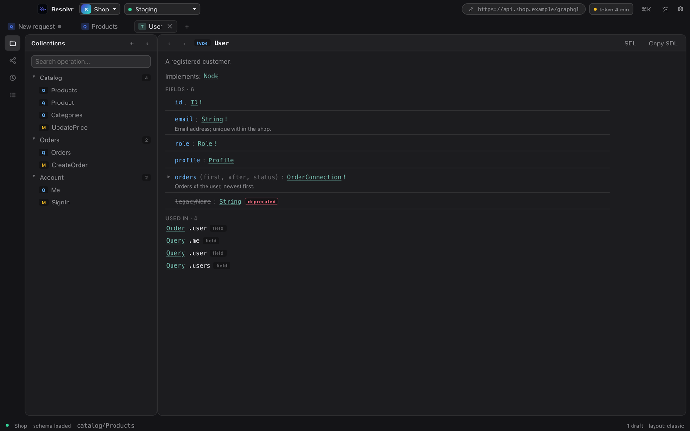
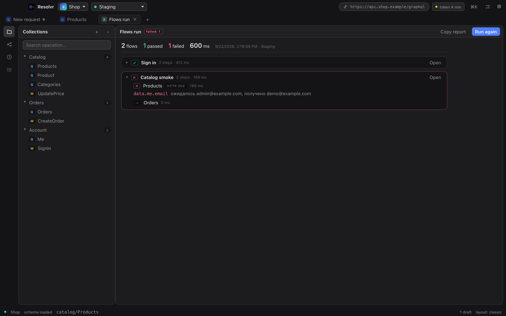

# Resolvr

A native GraphQL client for macOS that never loses your state — and that an AI agent
can drive through the same engine you use.

Resolvr replaces Apollo Explorer for teams: tabs and drafts survive restarts and crashes,
collections live in plain files you can keep in git, environments obtain and refresh
tokens by themselves, and flows turn your requests into smoke tests. A bundled MCP server
lets Claude Code build collections and run tests with every step narrated in the app.

Русская документация: [docs/README.ru.md](docs/README.ru.md) · installation guide:
[docs/INSTALL.md](docs/INSTALL.md).



<details>
<summary>More screens: response search, schema browser, flows report, command palette</summary>



| Schema browser | Flows report |
|---|---|
|  |  |

</details>

## Highlights

- **Never lose state** — every tab, draft, cursor and panel size is written atomically
  and restored after `kill -9`.
- **Team-friendly storage** — `~/Resolvr/workspaces/<name>/` is plain `.graphql` +
  JSON; clone a workspace from git and you have the team's collections. Personal data
  (secrets, history, layout) is kept out of the shared files.
- **Environments that log in for you** — a flow obtains the token, the app stores it,
  refreshes it before expiry and retries on auth errors. Production environments are
  marked `PROD` and ask before mutations.
- **Flows as smoke tests** — chain operations, extract values by path, assert on
  responses, run all of them with one click and copy a Markdown report.
- **Schema browser** — every type as a documentation page: fields with arguments and
  defaults, deprecations, enum values, implementations and "used in"; type names are links
  with back/forward history. Plus introspection with a freshness indicator, autocomplete
  that scaffolds arguments, click-to-build operations and schema diff after deploys.
- **Import** from Postman (collections and environments) and Insomnia exports.
- **Subscriptions** over `graphql-ws`, response search (⌘F), copy as curl, `resolvr://`
  links to share an exact request with a colleague.
- **Agent access** — an MCP server on the same core: workspaces, operations, runs, flows,
  schema search. Every call must state its intent; the app shows the full activity log.
- **macOS-native** — vibrancy, system accent, both themes, overlay title bar.

## Try it in a minute

Open Resolvr and press **Open the example** on the welcome screen: a workspace on a public
countries API appears with three queries, an environment variable and a smoke flow. Press
⌘↩ (Ctrl+Enter) to run the first one.

## Install

Download the DMG from Releases, drag Resolvr to Applications. Builds are not notarized
(no Apple Developer account) — on first launch right-click → Open, or
`xattr -d com.apple.quarantine /Applications/Resolvr.app`. See
[docs/INSTALL.md](docs/INSTALL.md) for the full walkthrough, including the MCP setup.

Linux and Windows builds are produced by CI (`.github/workflows/build.yml`). They work
without the native blur and without Keychain (secrets go to the library file).

## Develop

```bash
pnpm install
pnpm --filter @resolvr/mock-server start   # test GraphQL server on :4000
pnpm dev                                   # Tauri dev mode

pnpm typecheck && pnpm lint && pnpm test   # before pushing
pnpm install:app                           # build and install into /Applications
pnpm release                               # universal DMG into dist/
```

Screenshots in this README come from the showcase page (`showcase.html`, fixtures only):
`pnpm --filter @resolvr/desktop shots` renders every screen with Playwright, then
`python3 scripts/readme-media.py <shots dir>` resizes them and assembles the GIF.

Requirements: Node.js 20+, pnpm 10, Rust stable, Xcode Command Line Tools.

| Package | Role |
|---|---|
| `apps/desktop` | Tauri v2 (Rust) + React 19 + CodeMirror 6 |
| `packages/core` | Model, storage, run engine, flows, schema — no Tauri, no Node |
| `packages/mcp-server` | MCP server on top of the core, bundled into the app |
| `tools/mock-server` | Test GraphQL server with subscriptions and login |

## License

Resolvr is source-available under the
[Functional Source License 1.1 with Apache 2.0 future license](LICENSE.md): use it, modify
it and redistribute it for any purpose except offering it as a competing product; each
version becomes Apache 2.0 two years after release. See [CONTRIBUTING.md](CONTRIBUTING.md)
before submitting changes.
